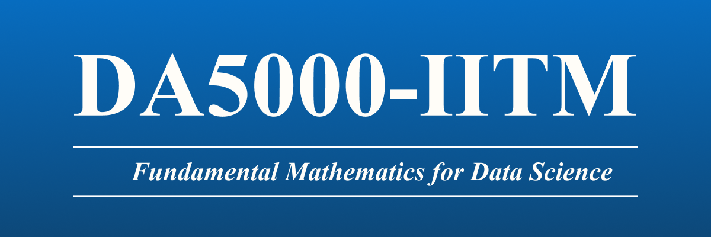

# DA5000 | IITM | Fundamental Mathematics For Data Science 
This Repository is to share the learnings from DA5000 at IIT Madras " Fundamental Mathematics For Data Science "

## This Includes:-
- Weekly notes
- Assignments 
- Implimentation in Python

